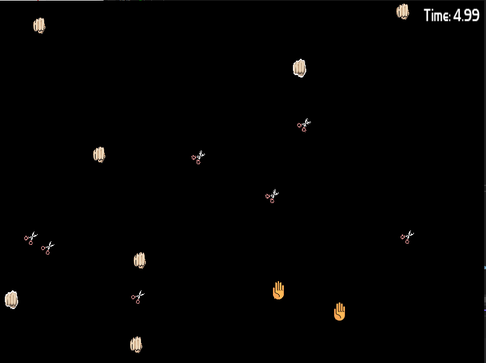
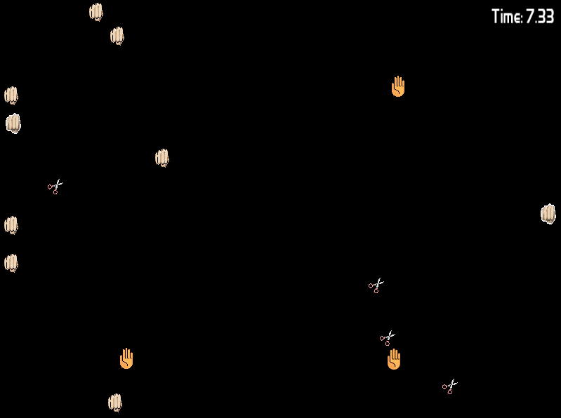
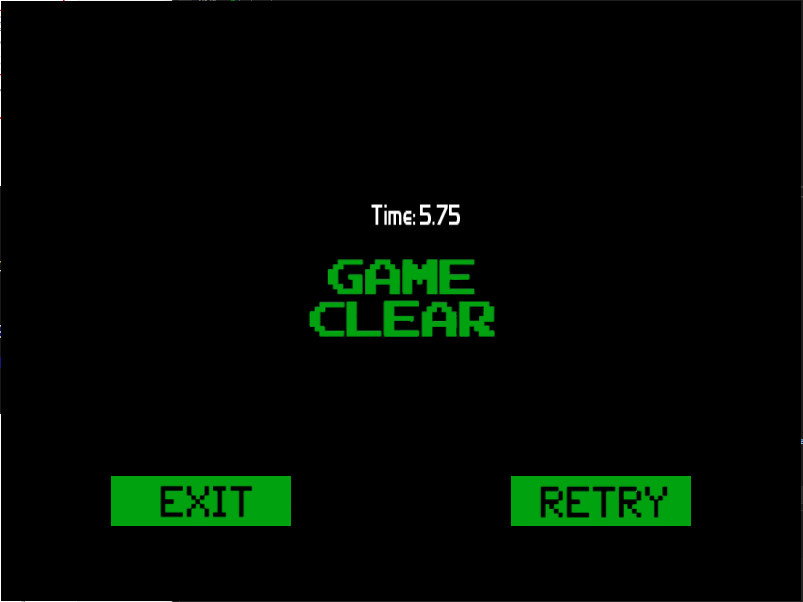
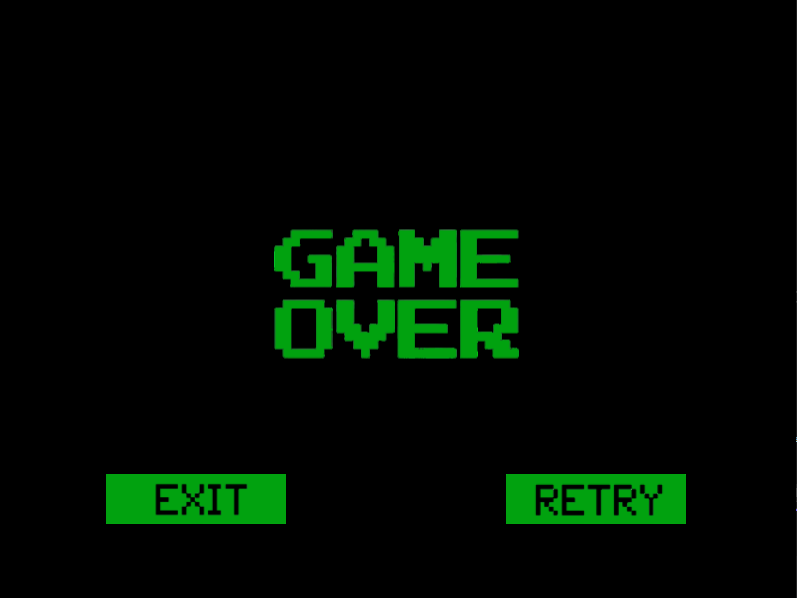
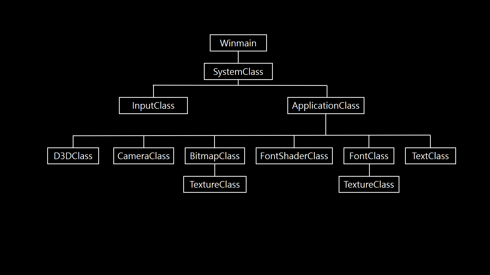

# 🎮 [DirectX 11] DirectX 2D Game Portfolio :: RSP Game

2D 기반의 DirectX 11 게임 프로젝트입니다. 저수준 그래픽 API를 활용하여 게임 루프, 렌더링 파이프라인, UI 및 입력 처리 등을 구현한 포트폴리오입니다.

---

## 📑 목차

1. [프로젝트 소개](#프로젝트-소개)
2. [규칙 소개](#규칙-소개)
3. [주요 기능](#주요-기능)
4. [게임 스크린샷](#게임-스크린샷)
5. [기술 스택](#기술-스택)
6. [아키텍처](#아키텍처)
7. [티스토리 블로그](#티스토리-블로그)

---

## 📌 프로젝트 소개

- DirectX 11을 기반으로 한 간단한 구조의 2D 게임 개발 포트폴리오입니다.
- DirectXTK의 SpriteBatch, WICTextureLoader를 이용하여 2D UI와 PNG를 간결하게 구현하였습니다.
- **렌더 타겟 설정, 깊이 버퍼 구성, 정점 버퍼 및 인덱스 버퍼를 직접 구성하여 DirectX 11의 렌더링 파이프라인을 저수준에서 구현하였습니다.**
- 게임 루프, 시간 기반 애니메이션, 입력 시스템, 리소스 로딩을 학습하고 적용했습니다.
- 개발기간 2025.03.02 ~ 2025.03.09 

---

## 📌 규칙 소개

- 플레이어는 시작 시 가위, 바위, 보 중 하나를 부여받습니다.
- 플레이어를 제외하고 각각5개씩 가위, 바위, 보가 랜덤한 위치, 속도값을 부여받습니다.
- 두 객체 충돌 :: 서로 다른 객체가 만날 시 승패에 따라 이미지 변환과 속도 변환이 이루어 집니다. 예를 들어 가위와 바위가 만났다면 가위 객체가 바위 객체로 변환됩니다.
- 두 객체 충돌 :: 같은 객체가 만날 시 속도 변환이 이루어집니다.
- 승리조건 :: 모든 객체를 자신의 이미지로 바꾸면 승리.
- 패배조건 :: 내 객체가 다른 객체에 의해 패배.
- 본인과 같은 이미지를 가지는 객체를 밀어내어 전략적 접근이 가능합니다.

---

## 🎮 주요 기능

- ✅ 게임 루프 및 시간 기반 애니메이션
- ✅ Sprite 렌더링 (SpriteBatch)
- ✅ 텍스처 로딩 및 해상도 대응
- ✅ 키보드 입력 처리
- ✅ UI 텍스트 출력 (FontClass)
- ✅ 게임 내 오브젝트 이동 및 상호작용
- ✅ 간단한 충돌 처리

---

## 🖼 게임 스크린샷

---

## 🧱 기술 스택

| 분류          | 내용 |
|---------------|------|
| 🎮 그래픽 API | **Direct3D 11** - 저수준 렌더링 파이프라인 구성 (렌더 타겟, 뎁스 버퍼, 버텍스/인덱스 버퍼 등) |
| 🧵 언어       | **C++** - 클래스 기반 구조, 포인터 활용, WinAPI와의 연동 |
| 🖥 플랫폼      | **Windows 10 (x64)** - WinAPI를 활용한 창 생성 및 메시지 루프 구성 |
| 🧰 개발 도구  | **Visual Studio 2022** - C++ 컴파일, 디버깅, 디렉터리 설정 |
| 🎨 텍스처 로딩 | **WICTextureLoader** (from DirectXTK) - PNG 파일 로딩 |
| 🖋 폰트 출력   | **SpriteFont / FontClass** - DirectXTK 기반 텍스트 출력 |
| 🔁 루프 & 타이머 | **GameTimer / Elapsed Time 계산** - 시간 기반 애니메이션 구현 |
| ⌨ 입력 처리   | **WinAPI 기반 키보드 입력 처리 (GetAsyncKeyState)** |
| 🔧 기타 유틸   | **SpriteBatch** - 2D UI 요소 및 오브젝트 배치 |

---

## 🧩 클래스 아키텍처 구성

아래는 본 프로젝트의 주요 클래스 간 관계를 표현한 계층 구조입니다.  

---

## 📎 티스토리 블로그

더 자세한 개발 기록과 기술적 분석은 아래 블로그 포스트에서 확인할 수 있습니다

👉 [https://fn000.tistory.com/](https://fn000.tistory.com/)
